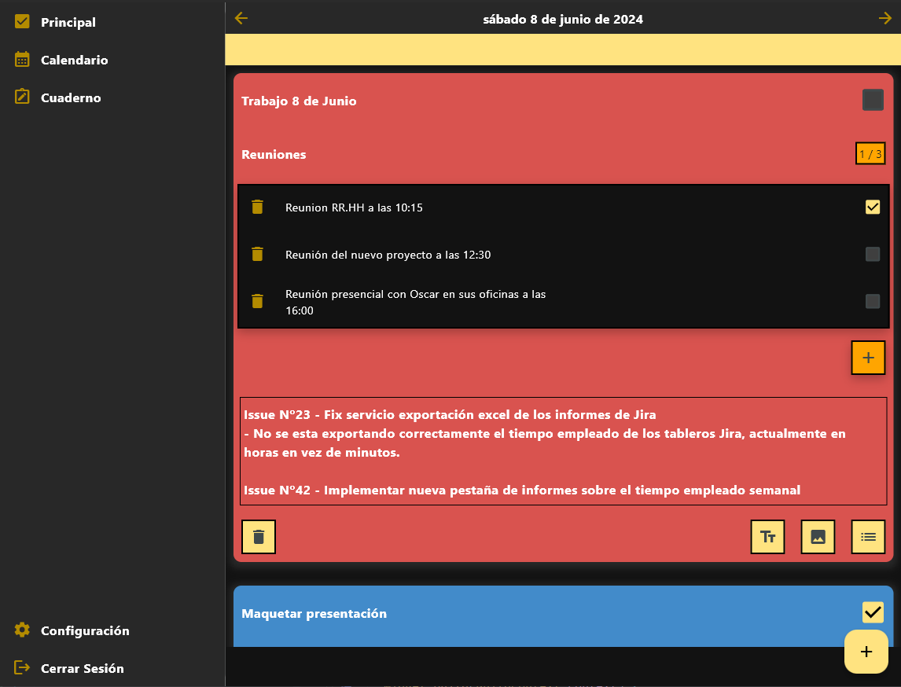
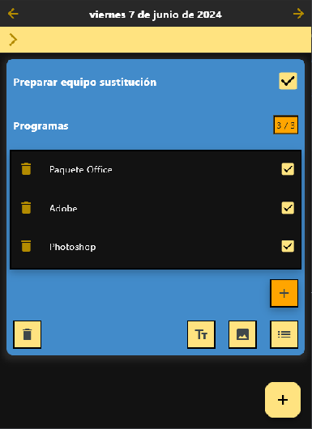
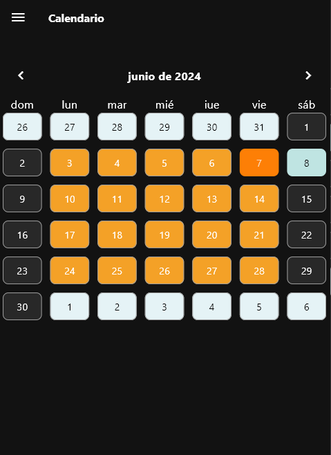
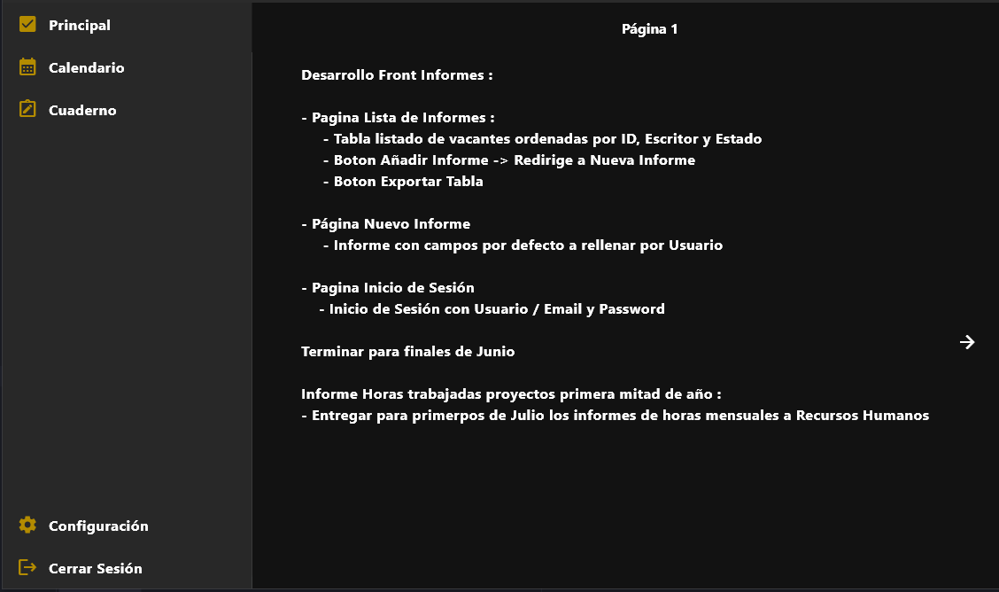

# TaskMate

## ¿Que es TaskMate?

TaskMate es una aplicación robusta y eficiente diseñada para ayudar a los usuarios a organizar sus actividades diarias mediante la gestión de notas y tareas. Con una interfaz intuitiva y funcionalidades sencillas, TaskMate se convierte en el asistente ideal para mejorar tu productividad y mantenerte al día con tus responsabilidades.

TaskMate funciona a través de la construcción de tareas personalizadas formadas a partir de distintos elementos que te permitirán organizar tu dia a dia de una forma personalizada y única.

## Características de TaskMate

TaskMate te permite trabajar en distintas plataformas como Android y Windows y compartir tu trabajo diario entre todos tus dispositivos para que siempre puedas tener el control sobre tu dia en cualquier parte, ya sea en tu trabajo a través de tu teléfono móvil o desde tu casa en tu ordenador personal.

TaskMate te permite organizar tu trabajo organizándolo de forma diaria y de una forma sencilla e intuitiva, a la vez que puedes crear tareas mas complejas y con más información de una forma rápida y sencilla

Navega entre los distintos dias del mes de una forma rápida y sencilla para poder organizar todo tu trabajo rápidamente.

Toma notas e información rápidamente y compártela en todos tus dispositivos para que nunca se te olvide nada

Notificaciones diarias a elección del Usuario para ayudarte a recordar tu trabajo.

Marca tus tareas realizadas y lleva un historial de todo tu trabajo hasta la fecha.



<p align="center">
  
  
</p>



## Instalación y Uso

En este momento TaskMate está todavía en desarrollo y no tiene un release lanzado. 

Si tienes curiosidad sobre TaskMate y el proyecto te invito a pasarte por la siguiente sección.

## Colaboración en el Proyecto

### Instalación

1. Clona el Repositorio: 

```
git clone https://github.com/AlvaroDVA/Taskmate
```

2. Navega al directorio del proyecto
```
cd taskmate_app
```
3. Instala las dependencias: 
```
flutter pub get
```

4. Inicia el Proyecto
```
flutter run
```
5. Registrate con una cuenta personal

### Recomendaciones

Aunque se puede empezar a trabajar en el proyecto con esto recomiendo clonar también mi API [TaskMate_API](https://github.com/AlvaroDVA/Taskmate_API)
para que puedas entender el funcionamiento del almacenamiento de la información. Las instrucciones para la instalación están en
el repositorio.

En el caso de que trabajes con la API en local te tocara adicionalmente configurar el config.properties en /assets

```
# config.properties

theme = dark
language = spanish
urlApi = # Cambiar a la dirección local de la API
```

Es recomendable cambiar al trabajo completamente en local para evitar problemas de conexión con el servidor.

También recomiendo el uso de un contenedor de MongoDB personal para poder comprobar las modificaciones directamente.

### Trabajo en el repositorio

Todo el trabajo tendrá que realizarse en una rama independiente de la main. Cualquier cambio en la rama principal será rechazado automaticamente.

Todos los pull request tienen que tener la información clara sobre las mejoras realizadas y tener un código lo mas limpio posible.

### Issues y problemas

Cualquier persona es libre de abrir una Issue en cualquier momento y se intentará solucionar lo antes posible.

Las Issues deben tener documentado correctamente el problema, el código de error si existiese y la forma de replicar dicho error. 

## Dependencias

TaskMate utiliza las siguientes dependencias para su funcionamiento:
- [Provider](https://pub.dev/packages/provider) - 6.1.2
- [UUID](https://pub.dev/packages/uuid) - 4.0.0
- [Properties](https://pub.dev/packages/properties) - 2.1.0
- [Crypto](https://pub.dev/packages/crypto) - 3.0.3
- [http](https://pub.dev/packages/http) - 1.2.0
- [shared_preferences](https://pub.dev/packages/shared_preferences) - 2.2.3
- [intl](https://pub.dev/packages/intl)
- [path_provider](https://pub.dev/packages/path_provider) - 2.1.3
- [image_picker](https://pub.dev/packages/image_picker) - 1.0.8
- [file_picker](https://pub.dev/packages/file_picker) - 1.0.8
- [windows_manager](https://pub.dev/packages/window_manager) - 0.3.9
- [table_calendar](https://pub.dev/packages/table_calendar) - 3.0.9
- [flutter_local_notifications](https://pub.dev/packages/flutter_local_notifications) - 17.1.2
- [timezone](https://pub.dev/packages/timezone) - 0.9.3
- [convert](https://pub.dev/packages/convert) - 3.1.1